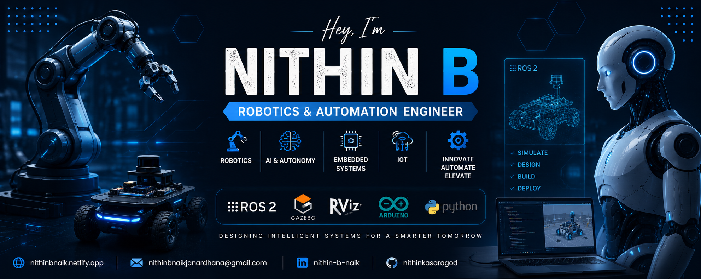

<!-- ========================= -->
<!-- 🚀 FUTURISTIC HEADER -->
<!-- ========================= -->
<p align="center">
  
</p>


<h1 align="center">
  
</h1>

---

<div align="center">

# 🤖 Robotics & Automation Engineer | ROS 2 and Simulation (Gazebo & RViz) | Embedded Systems | IoT | Hardware + Software Integration | Autonomous Robots | AI Robotics


</div>

---

# 🌐 Connect With Me

<div align="center">

<a href="mailto:nithinbnaikjanardhana@gmail.com" target="_blank">

</a>

<a href="https://linkedin.com/in/nithin-b-naik" target="_blank">

</a>

<a href="https://github.com/nithinkasaragod" target="_blank">

</a>

<a href="https://x.com/NithinB80630674" target="_blank">

</a>

<a href="https://www.facebook.com/nithin.nithinbnaik/" target="_blank">

</a>

<a href="https://www.instagram.com/nithin_b_naik_2002/" target="_blank">

</a>

<a href="https://www.youtube.com/@mini_technology009" target="_blank">

</a>

<a href="https://nithinbnaik.netlify.app/" target="_blank">

</a>

</div>

---

# 🌌 About Me


```

👋 Hey, I'm Nithin B

I am an ambitious and driven Robotics and Automation Engineer passionate about bridging the gap between hardware and software to build intelligent, real world systems. My academic journey at Jyothi Engineering College and along with specialized training from PG Diploma in ROS at I Hub School of Learning, has equipped me with strong technical foundations and hands on experience in modern robotics. I have developed practical skills in ROS 2, Embedded Systems, IoT based projects, CAD design using Fusion 360, and hardware assembly and integration. I enjoy working at the intersection of AI, automation, and robotics where ideas turn into functional systems. I am particularly interested in developing autonomous and intelligent robotic solutions, and I continuously strive to improve my problem solving abilities through real world projects and experimentation.

specialization:
  - ROS 2
  - Gazebo Simulation
  - RViz Visualization
  - Embedded Systems
  - ESP32 Development
  - IoT Systems
  - Autonomous Robots

currently_learning:
  - AI Robotics
  - Navigation Stack
  - SLAM & Mapping

goal:
  Build futuristic intelligent robotic systems
```

---

# ⚡ Tech Arsenal

<div align="center">


</div>

---

# 🤖 Robotics Stack

<div align="center">


</div>

---

# 🚀 Featured Robotics Projects

<div align="center">

<table>
<tr>
<td width="50%">

## 🔥 Fire Fighting Robot
Autonomous flame detection and suppression robot using sensors and embedded systems.

<a href="https://github.com/nithinkasaragod/fire-fighting-robot">

</a>

</td>

<td width="50%">

## 🤖 Otto Biped Robot
Humanoid walking robot with Arduino-based motion control.

<a href="https://github.com/nithinkasaragod/otto-biped-robot">

</a>

</td>
</tr>

<tr>
<td width="50%">

## 📚 LiberBot
Autonomous library management and navigation robot.

<a href="https://github.com/nithinkasaragod/liberbot">

</a>

</td>

<td width="50%">

## 🦾 4DOF Robotic Arm
Pick-and-place robotic arm using servo motor control.

<a href="https://github.com/nithinkasaragod/4dof-robotic-arm">

</a>

</td>
</tr>
</table>

</div>

---

# 📊 GitHub Analytics

<div align="center">


</div>

---

<div align="center">


</div>

---

# 📈 Contribution Graph

<p align="center">


</p>

---

# 🏆 GitHub Trophies

<div align="center">


</div>

---

# 🧠 Robotics Quote

<div align="center">

```diff
+ "Designing Intelligent Systems For A Smarter Tomorrow 🤖"
```

</div>

---

# 👀 Profile Visitors

<div align="center">


</div>

---

<div align="center">


</div>
